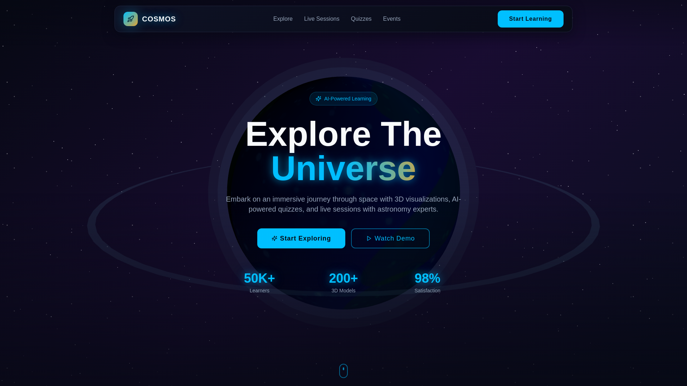

# 🚀 COSMOS - AI-Powered 3D Space Learning Platform

An immersive space education platform that combines 3D visualization, AI-powered quizzes, and live streaming to make astronomy learning engaging and interactive.


## 📸 Screenshots

### Hero Section with 3D Planet

*Immersive 3D planet visualization with orbital controls and cosmic design*

## ✨ Features

### 🌍 3D Space Exploration
Navigate through stunning interactive 3D models of planets, moons, stars, and galaxies with smooth orbital controls.

### 🤖 AI-Powered Quizzes
Experience adaptive quizzes that dynamically adjust difficulty based on your performance and learning pace.

### 📡 Live Streaming
Join live sessions with astronomy experts and space scientists from around the world.

### 🔔 Smart Notifications
Get AI-powered alerts about upcoming space events, eclipses, meteor showers, and rocket launches.

### 📊 Progress Tracking
AI analyzes your learning journey and suggests personalized topics to explore next.

### 🔭 Virtual Observatory
Access real telescope feeds and explore current celestial phenomena in real-time.

## 🛠️ Tech Stack

- **Frontend**: React 18 + TypeScript + Vite
- **3D Graphics**: React Three Fiber + Three.js + Drei
- **Styling**: Tailwind CSS + Custom Design System
- **Animations**: Framer Motion
- **UI Components**: Radix UI + shadcn/ui

## 🚀 Getting Started

### Prerequisites

- Node.js 18+ or Bun
- npm, yarn, or bun package manager

### Installation

```bash
# Clone the repository
git clone <YOUR_GIT_URL>

# Navigate to project directory
cd <YOUR_PROJECT_NAME>

# Install dependencies
npm install

# Start development server
npm run dev
```

The app will be available at `http://localhost:5173`

### Build for Production

```bash
npm run build
```

## 🎨 Design System

COSMOS features a custom cosmic design system with:

- **Colors**: Deep space darks, electric cyan primary, solar orange accents
- **Typography**: Orbitron (display) + Inter (body)
- **Effects**: Glowing elements, star backgrounds, smooth animations
- **Components**: Custom cosmic button variants, glowing cards, animated sections

## 📁 Project Structure

```
src/
├── components/
│   ├── ui/              # shadcn/ui components
│   ├── Navbar.tsx       # Navigation with cosmic styling
│   ├── HeroSection.tsx  # 3D planet hero
│   ├── SpaceScene.tsx   # Three.js 3D scene
│   ├── FeaturesSection.tsx
│   ├── LiveEventsSection.tsx
│   ├── QuizSection.tsx  # Interactive quiz demo
│   └── Footer.tsx
├── pages/
│   └── Index.tsx        # Main landing page
├── index.css            # Design system tokens
└── App.tsx              # App router
```

## How can I edit this code?

There are several ways of editing your application.

**Use Lovable**

Simply visit the [Lovable Project](https://lovable.dev/projects/REPLACE_WITH_PROJECT_ID) and start prompting.

Changes made via Lovable will be committed automatically to this repo.

**Use your preferred IDE**

If you want to work locally using your own IDE, you can clone this repo and push changes. Pushed changes will also be reflected in Lovable.

The only requirement is having Node.js & npm installed - [install with nvm](https://github.com/nvm-sh/nvm#installing-and-updating)

## 🌐 Deployment

Simply open [Lovable](https://lovable.dev/projects/REPLACE_WITH_PROJECT_ID) and click on Share -> Publish.

Other deployment options:
- **Vercel**: `vercel deploy`
- **Netlify**: Connect GitHub repo
- **GitHub Pages**: Use GitHub Actions

## Can I connect a custom domain?

Yes! Navigate to Project > Settings > Domains and click Connect Domain.

Read more here: [Setting up a custom domain](https://docs.lovable.dev/features/custom-domain#custom-domain)

## 📄 License

MIT License - feel free to use this project for learning and building!

---

<p align="center">
  Built with ❤️ using <a href="https://lovable.dev">Lovable</a>
</p>
